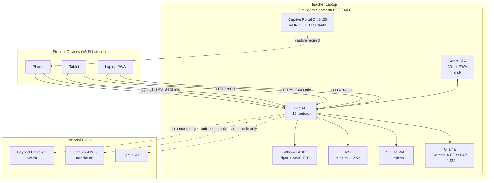
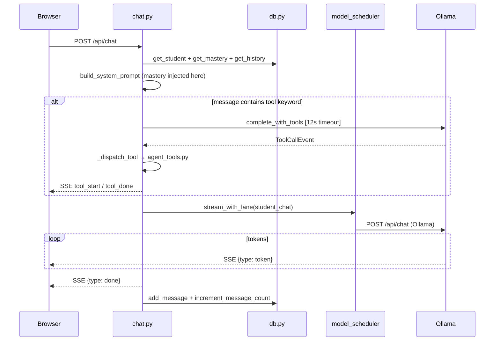
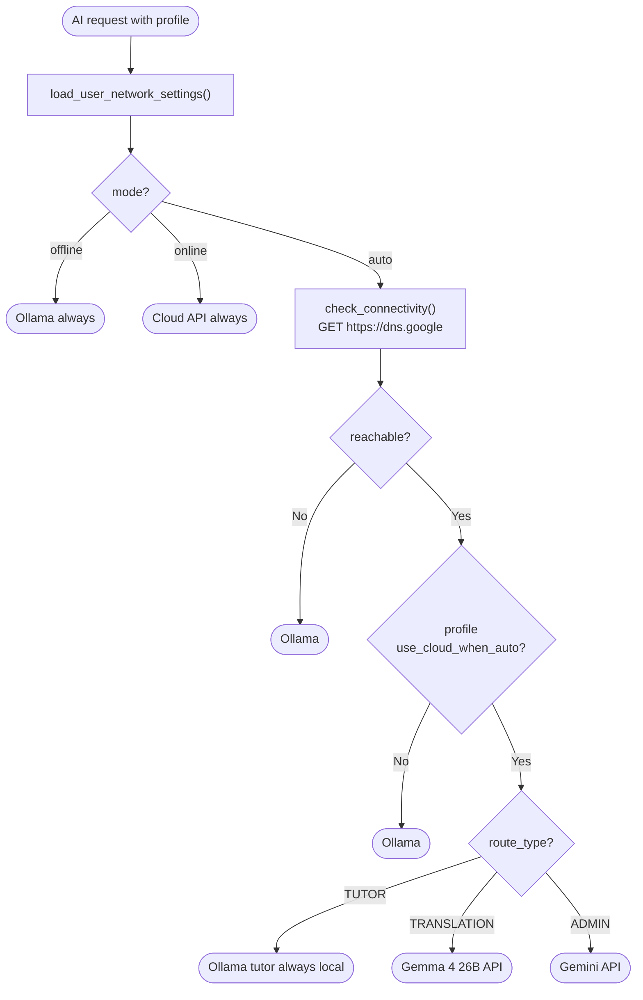
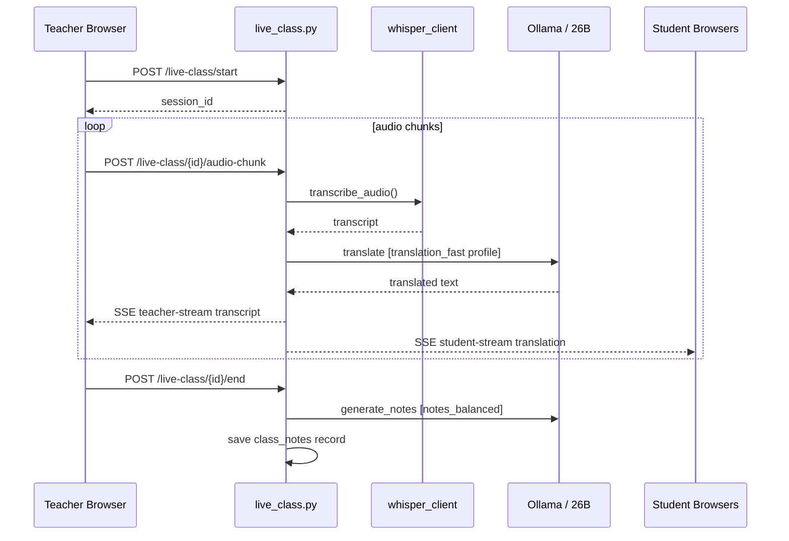
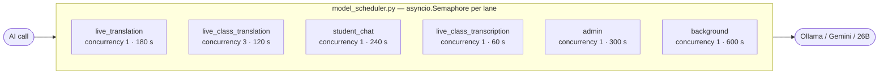
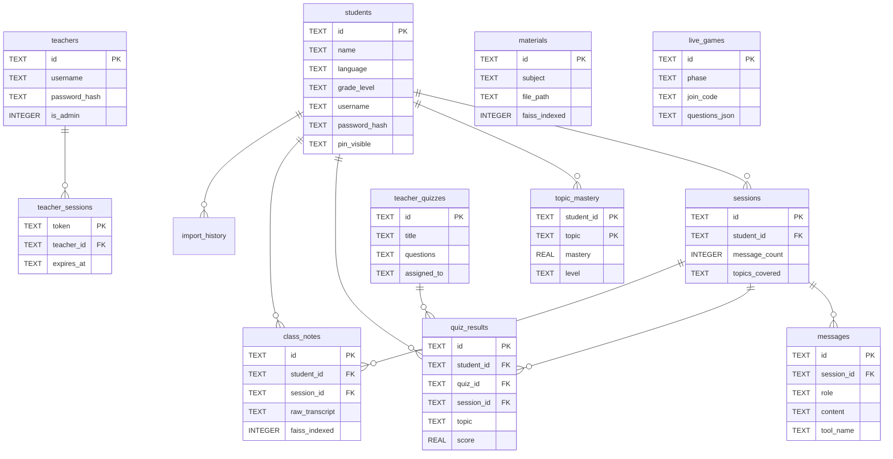
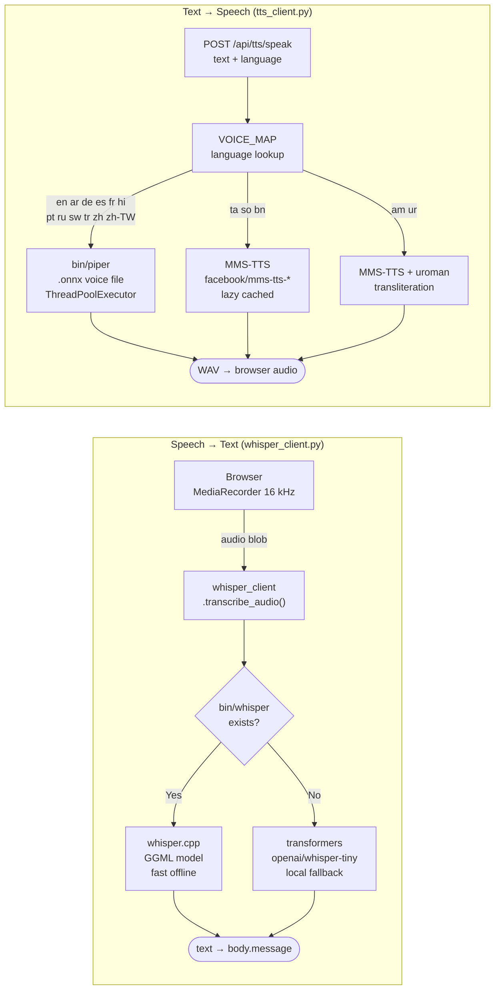
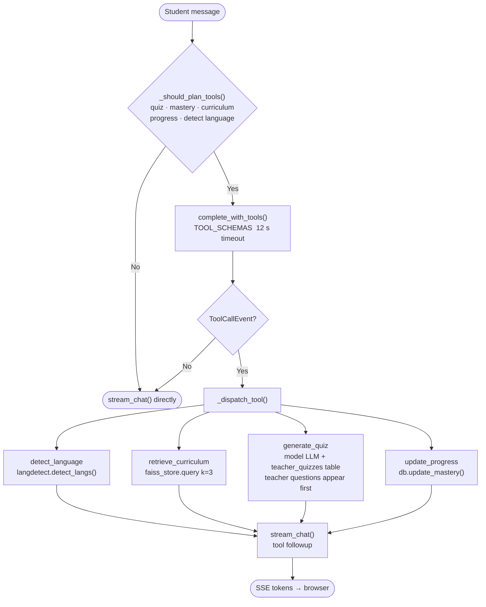
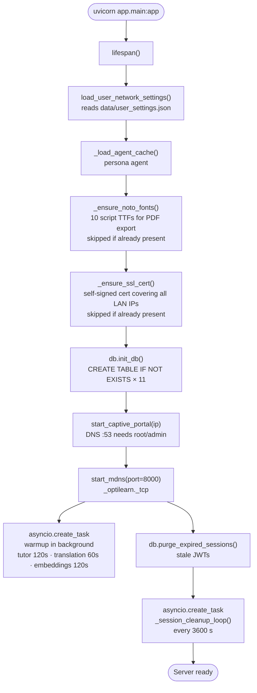
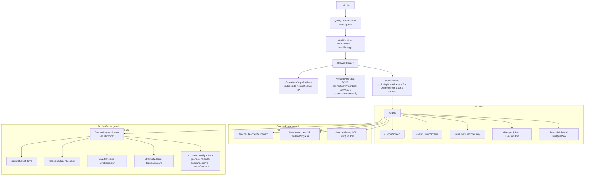

# OptiLearn Architecture

**Version 1.0.0** · Python 3.11 · FastAPI · React 18 · SQLite · Ollama · FAISS

---

## What Is This Document

This is an orientation guide for contributors. Its goal is to answer one question before you touch any code: *where does X live, and why is it there?*

It does not replace code comments, docstrings, or the README. It is not a spec. Treat it as a country map, not a street atlas — enough to orient you, not enough to be a liability when the code moves.

---

## The Problem This Project Solves

Refugee camps and disaster-recovery classrooms have students but no reliable internet. Commercial ed-tech requires cloud accounts, subscriptions, and always-on connectivity. OptiLearn runs entirely on a teacher's laptop, serves 30+ student browsers over a local Wi-Fi hotspot, and requires no internet connection to function. When internet is available it can optionally route certain requests to larger cloud models.

Every architectural decision flows from that constraint: **offline first, zero external dependencies at runtime**.

---

## Bird's-Eye View



The React SPA is built once (`npm run build`) and served as static files by the same FastAPI process. There is no separate frontend server in production. The single Uvicorn process handles everything.

---

## Codemap

This section answers "where does X live?" for the most common starting points.

### Backend

```
optilearn/app/
├── main.py               Entry point. App factory, lifespan startup, middleware, router mounts, SPA catch-all.
│
├── api/
│   ├── sse.py            One function: format a dict as an SSE data line. Used by every streaming route.
│   └── routes/           One file per domain. Each owns its HTTP layer only — no business logic.
│       ├── chat.py         Core tutor chat. The most important file. Owns the SSE tool-dispatch loop.
│       ├── live_class.py   Real-time audio translation pipeline (teacher → students).
│       ├── live_quiz.py    Kahoot-style quiz game engine.
│       ├── translate.py    Document translation + notes generation.
│       ├── feature1.py     Material explain/ask/translate + TTS router (tts_router lives here).
│       ├── auth.py         Student + teacher + admin authentication. JWT for teachers, PIN for students.
│       ├── students.py     Student CRUD, progress, export/import.
│       ├── teacher.py      Teacher dashboard data: roster, heatmap, alerts, schedule.
│       ├── teacher_quiz.py Quiz builder (teacher) and quiz list (student). Two routers in one file.
│       ├── materials.py    Material upload, listing, FAISS reindex trigger.
│       ├── sessions.py     Chat session lifecycle.
│       ├── persona.py      Beyond Presence avatar chat.
│       ├── dashboard.py    Aggregated teacher analytics.
│       ├── network.py      Hotspot IP detection, QR code, captive portal status.
│       └── settings.py     Network mode toggle (offline / auto / online).
│
├── core/
│   ├── config.py         Single source of truth for all settings. Pydantic BaseSettings reads from .env.
│   ├── prompts.py        Builds the system prompt per student. Injects mastery data here.
│   ├── languages.py      Supported language list (ISO 639-1 codes + display names).
│   ├── grades.py         Grade level normalisation helpers.
│   └── text_formatting.py  Text cleanup utilities.
│
├── models/
│   └── schemas.py        All Pydantic request/response models. Read this before touching any route.
│
├── services/             Business logic. Routes call services; services never import routes.
│   ├── db.py               Every SQLite operation. WAL mode. The only file that touches the DB.
│   ├── model_client.py     AI routing abstraction. Decides Ollama vs Gemini vs 26B. The routing brain.
│   ├── model_scheduler.py  6-lane priority semaphore queue. Prevents live translation starvation.
│   ├── context_prep.py     Trims chat history to fit the context budget.
│   ├── faiss_store.py      Vector similarity search over curriculum.
│   ├── whisper_client.py   ASR: whisper.cpp binary first, HF transformers fallback.
│   ├── tts_client.py       TTS: Piper (14 langs) + MMS-TTS (Tamil, Somali, Amharic, Bengali, Urdu).
│   ├── student_transfer.py Encrypted ZIP export/import (pyzipper AES-256).
│   ├── job_manager.py      In-memory background job tracking.
│   ├── telemetry.py        AI request tracing and latency metrics.
│   ├── generated_cache.py  Output cache for quiz / report / translation results.
│   ├── client_tracker.py   Tracks student devices connected to the hotspot.
│   ├── network.py          Detects the hotspot IP via psutil network interface scan.
│   ├── dns_server.py       Captive portal DNS server (dnslib, UDP :53).
│   └── mdns_server.py      mDNS service advertisement via zeroconf.
│
└── tools/
    └── agent_tools.py    Four agent tools + TOOL_SCHEMAS list. Called by the model during chat.
```

### Frontend

```
optilearn/frontend/src/
├── App.jsx               Root: QueryClientProvider → AuthProvider → BrowserRouter → NetworkGate → Routes.
├── main.jsx              React DOM entry. Mounts App.
│
├── api/client.js         All fetch calls in one place. Import these in screens/hooks, not raw fetch().
│
├── context/
│   ├── AuthContext.jsx   Global auth state. studentId and teacherToken live here, persisted to localStorage.
│   └── ThemeContext.jsx  Theme toggle including dyslexia-friendly font.
│
├── hooks/
│   ├── useSSE.js           Generic EventSource consumer. Used by StudentSession and LiveTranslator.
│   ├── useLiveQuizSocket.js  SSE consumer for the live quiz game state.
│   └── useDashboard.js     Teacher dashboard data via react-query.
│
├── screens/              Page-level components. One file per route.
│   ├── StudentSession.jsx    The core student experience. Renders the SSE chat stream.
│   ├── TeacherDashboard.jsx  Teacher root. Hosts MaterialUpload, TeacherQuizBuilder,
│   │                         LiveClassTeacherPanel, DiagnosticsPanel as embedded views.
│   ├── LiveTranslator.jsx    Student-side real-time translation listener.
│   ├── livequiz/             Four screens for the live quiz game flow.
│   └── ...                   Other LMS screens (courses, grades, calendar, etc.).
│
├── components/           Reusable UI. Never fetch data here — receive it as props.
│   ├── StudentLayout.jsx   Sidebar navigation wrapper for all student/:id/* routes.
│   ├── ChatMessage.jsx     Renders one message: Markdown, LaTeX, code blocks.
│   ├── FormattedText.jsx   Mixed Markdown + LaTeX renderer used by ChatMessage.
│   ├── TopicHeatmap.jsx    Teacher analytics: topic × student mastery grid.
│   └── ...                 15 more components (badges, modals, pickers, spinners).
│
├── utils/
│   ├── audioCapture.js   MediaRecorder wrapper for microphone input.
│   └── personaIcons.jsx  Avatar icon map for persona picker.
│
└── pwaInstall.js         PWA install prompt logic (wraps the beforeinstallprompt event).
```

---

## Architecture Invariants

These are the constraints you must not break. They are not documented in code because code does not enforce absence.

**1. Routes do not touch the database directly.**  
All SQLite access goes through `services/db.py`. Routes call service functions. If you find a route importing `aiosqlite` directly, that is a bug.

**2. `tutor_fast` profile never routes to cloud.**  
`MODEL_PROFILES["tutor_fast"]` has `use_cloud_when_auto = False`. Student chat always stays local regardless of internet availability. Cloud costs and latency are unacceptable for the core tutoring loop.

**3. `ensure_ascii=False` in every SSE payload.**  
The shared `sse()` function in `app/api/sse.py` uses `json.dumps(event, ensure_ascii=False)`. Arabic, Amharic, Tamil tokens would otherwise inflate 3–6× per character. Do not inline `json.dumps` in a route without this flag.

**4. Services never import routes.**  
The dependency arrow is one-way: `routes → services → db`. Circular imports here will cause FastAPI startup failures that are painful to debug.

**5. `db.py` is the only file that holds a database connection.**  
All other files call async functions in `db.py`. This makes the WAL pragma and foreign key enforcement happen in exactly one place.

**6. The frontend never reads auth state from anywhere except `AuthContext`.**  
`teacherToken` and `studentId` are stored in localStorage and read exclusively through `AuthContext.jsx`. Do not read `localStorage` directly in screens or components.

---

## Key Data Flows

### Student Chat (the critical path)



### AI Model Routing



### Live Class Translation



---

## Scheduler Lanes

Every AI request goes through a named lane. The lane determines concurrency and timeout. This prevents a quiz generation from blocking a live translation.



The five `MODEL_PROFILES` map onto these lanes:

| Profile | Lane | Cloud auto-route |
|---------|------|-----------------|
| `tutor_fast` | `student_chat` | Never |
| `translation_fast` | `live_translation` | Gemma 26B |
| `notes_balanced` | `background` | Gemma 26B |
| `admin_balanced` | `admin` | Gemini |
| `deep_optional` | `background` | Gemini + think |

---

## Database Schema

11 tables in a single SQLite file. WAL mode. Foreign keys enforced on every connection.



The `topic_mastery` table is the adaptive engine. Every quiz result flows through `db.update_mastery()`, which recalculates the running average score and maps it to a level (`beginner → developing → proficient → advanced → mastered`). The next chat turn calls `db.get_student_mastery()` and injects this into the system prompt via `prompts.py`.

---

## Voice Pipeline

Two separate subsystems. Both run locally with no cloud dependency.



`tts_client.py` uses a `ThreadPoolExecutor` (not `asyncio.subprocess`) because Piper spawns a subprocess and Windows' `ProactorEventLoop` cannot run asyncio subprocesses from an async context. Do not refactor this to `asyncio.create_subprocess_exec` without testing on Windows.

---

## Agent Tool System

The tutor model has access to four tools. They are only invoked when `_should_plan_tools()` returns `True` — a keyword check on the student's message. This avoids the latency of a planning generation on every chat turn.



---

## Startup Sequence



Warmup runs as a background task so the server accepts requests immediately. Students who connect within the first ~10 seconds may see a slower first response while Ollama loads the model weights.

---

## Frontend Structure



---

## Cross-Cutting Concerns

**Error handling in SSE streams**  
Once a `StreamingResponse` has started, HTTP status codes are no longer available. Errors are sent as `data: {"type": "error", "message": "..."}` events. The browser-side `useSSE` hook listens for this event type. Never throw an unhandled exception inside an `event_stream()` generator — the stream closes silently.

**Multilinguality throughout**  
`ensure_ascii=False` is used in every `json.dumps` call that produces SSE output. Arabic, Amharic, Tamil, and Devanagari script would otherwise produce `\uXXXX` escapes that inflate payload size 3–6×. This matters on 2G / shared hotspot bandwidth. The check is centralised in `app/api/sse.py`.

**Network mode is runtime-configurable**  
`USE_LOCAL_OLLAMA=true` in `.env` sets the default. The teacher can toggle between `offline / auto / online` at runtime via `POST /api/settings/network-mode` without restarting the server. The setting persists to `data/user_settings.json`. Read `model_client.load_user_network_settings()` to understand the precedence logic.

**HTTPS is required for microphone access**  
Browser `MediaRecorder` API requires a secure context. The server auto-generates a self-signed certificate on first startup (`_ensure_ssl_cert()`) covering all detected LAN IPs. Students must accept the certificate warning once. Voice features do not work over plain HTTP even on the local network.

**Captive portal requires elevated privileges**  
`start_captive_portal()` binds to UDP port 53. On Linux/macOS this requires root. On Windows it requires Administrator. If the server starts without elevated privileges the captive portal is silently skipped and students must navigate to the server URL manually (or scan the QR code from the teacher dashboard).

---

## Where to Start

| Task | Start here |
|------|-----------|
| Add a new student-facing feature | `app/api/routes/chat.py` — understand the SSE loop first |
| Add a new teacher dashboard panel | `app/api/routes/teacher.py` + `screens/TeacherDashboard.jsx` |
| Change how AI model is selected | `app/services/model_client.py` — `MODEL_PROFILES` dict |
| Change how mastery is calculated | `app/services/db.py` — `update_mastery()` |
| Add a new language to TTS | `app/services/tts_client.py` — `VOICE_MAP` dict |
| Add a database column | `app/services/db.py` — `_SCHEMA_SQL` (use `ALTER TABLE` migration) |
| Change the student system prompt | `app/core/prompts.py` |
| Add a new agent tool | `app/tools/agent_tools.py` — add to `TOOL_SCHEMAS` and implement function |
| Understand the offline / online switching | `app/services/model_client.py` — `load_user_network_settings()` and `check_connectivity()` |
| Debug a slow response | `GET /api/health` → `scheduler.lanes` — check which lane is saturated |
