# OptiLearn

> **AI-powered offline classroom for the 300 million students with no internet.**

A teacher in a refugee camp opens a laptop. Within 30 seconds, every phone and tablet in the room connects to a private AI tutor — speaking the student's language, adapting to their level, asking questions instead of lecturing. No internet. No cloud account. No subscription. No IT department.

That's OptiLearn.

Built for the **[Gemma 4 Good Hackathon 2026](https://www.kaggle.com/competitions/gemma-4-good-hackathon/)** · Opti5 Labs

---

## The Problem

**300 million children** in conflict zones, refugee camps, and rural communities are out of school or learning in under-resourced classrooms with one teacher per 60+ students and no internet access.

Commercial ed-tech — Khan Academy, Duolingo, Google Classroom — requires cloud connectivity, device accounts, and reliable bandwidth. That excludes the students who need help most.

The hardware exists. Old laptops, Android phones, donated tablets — they're already in these classrooms. What's missing is software that runs on them.

---

## What OptiLearn Does

One teacher laptop becomes a **local AI tutoring server**. Students connect from any browser over a WiFi hotspot — no app install, no login, no internet.

```
Teacher opens OptiLearn
        │
        ▼
Ollama loads Gemma 4 locally (~15s)
        │
        ▼
Students connect at http://192.168.137.1:8000
        │
        ├── Arabic student gets Arabic tutor at Grade 3 level
        ├── Somali student gets Somali tutor at Grade 5 level
        ├── French student gets French tutor at Grade 7 level
        └── All adapt in real time as they answer questions
```

The AI knows each student by name, tracks what they've mastered, speaks their language, and never says "wrong" or "failed."

---

## Why Gemma 4

- **Runs on a 2015 laptop** with 8 GB RAM — no GPU required for the 2B model
- **100+ languages** natively, including Arabic, Somali, Amharic, Tamil, Tigrinya
- **On-device inference** via Ollama — zero data leaves the classroom
- **Gemma 4 26B cloud path** activates automatically when internet is available for richer translation and live class features, then falls back to local silently
- **Fine-tuning pipeline** included — the model can be specialized on trauma-aware pedagogy using the bundled dataset

---

## Key Features

### For Students
| Feature | What it does |
|---------|-------------|
| **AI Tutor Chat** | Conversational tutor in any language — knows the student's name, grade, and mastery history |
| **Translate & Learn** | Upload a PDF, photo, or text → instant translation + grade-level explanation in the student's language |
| **Adaptive Quizzes** | Questions that adjust to the student's level; mastery tracked with Exponential Moving Average |
| **Text-to-Speech** | Read anything aloud in 14 languages via Piper + 60+ via MMS-TTS (Tamil, Somali, Amharic, Bengali, Urdu) |
| **Multilingual PDFs** | Download explanations as PDFs rendered correctly for Arabic (RTL), Devanagari, Tamil, Ethiopic |
| **AI Voice Avatar** | Beyond Presence-powered voice chat for students who prefer speaking over typing (online, optional) |
| **Offline-first PWA** | Installable on Android/iOS home screen; service worker caches the UI for zero-latency reloads |

### For Teachers
| Feature | What it does |
|---------|-------------|
| **Live Class Mode** | Teacher speaks → Whisper transcribes → AI translates to every student's language in real time |
| **Mastery Heatmap** | Colour-coded grid showing every student × every topic at a glance |
| **Automatic Alerts** | Flags students who are inactive, stuck, or declining — before they fall through the cracks |
| **Quiz Builder** | Create and assign quizzes; AI auto-generates questions from curriculum |
| **Material Upload** | Drop in a PDF or image → FAISS indexes it → students can ask questions about it |
| **Live Quiz Game** | Kahoot-style quiz with a join code — all student devices play simultaneously |
| **PDF Progress Report** | One-click weekly report per student, rendered in their script |
| **Network QR Code** | QR code for the hotspot URL — students scan to connect, no typing required |

---

## How It Works

```
┌─────────────────────────────────────────────────────────┐
│                    Teacher Laptop                       │
│                                                         │
│  ┌────────────┐   ┌──────────────────────────────────┐  │
│  │  Ollama    │◄──│        OptiLearn Server          │  │
│  │ Gemma 4 2B │   │     FastAPI · uvicorn · :8000    │  │
│  │  :11434    │   │                                  │  │
│  └────────────┘   │  SQLite WAL · FAISS · Piper TTS  │  │
│                   │  React 18 SPA (served as static) │  │
│                   └──────────────────────────────────┘  │
│                              ▲ :8000 / :8443 (mic)      │
│                   WiFi Hotspot 192.168.137.1            │
└──────────────────────────────┼──────────────────────────┘
                               │
          ┌────────────────────┼────────────────────┐
┌─────────▼──────┐  ┌──────────▼──────┐  ┌──────────▼─────┐
│  Phone/Tablet  │  │  Tablet/Laptop  │  │  Any browser   │
│  (no app)      │  │  (no app)       │  │  (no app)      │
└────────────────┘  └─────────────────┘  └────────────────┘
```

**Online mode** (when internet is available): the same server transparently routes translation and live class requests to Gemma 4 26B via the Gemini API for higher quality, then falls back to local if the connection drops mid-class.

---

## Architecture

```mermaid
graph TD
    subgraph DESKTOP["Desktop Layer (Electron)"]
        MAIN["main.js\nElectron Main Process"]
        SETUP["setup.html\nFirst-Launch Wizard\n(API keys · Ollama check · model pull)"]
        PRELOAD["preload.js / preload-setup.js\nContext-Bridge IPC"]
        TRAY["System Tray"]
        LOADER["Loading Window\n(polls /api/health)"]
    end

    subgraph STUDENT_DEVICES["Student Devices (any browser on LAN)"]
        PHONE["Phone / Tablet\nPWA (installable)"]
    end

    subgraph NETWORK["Network Layer"]
        MDNS["mDNS (zeroconf)\noptilearn.local"]
        DNS["Captive Portal DNS (dnslib)\nredirects all HTTP → OptiLearn"]
        QR["QR Code enrollment"]
        TLS["Self-signed TLS cert\n(all LAN IPs as SANs)\nenables mic access on HTTPS :8443"]
    end

    subgraph SERVER["FastAPI Server (uvicorn :8000 / :8443)"]
        direction TB

        subgraph MIDDLEWARE["Middleware"]
            CAPTIVE_MW["CaptivePortalMiddleware\nredirects Apple/Google/Firefox probes"]
            CORS["CORS Middleware"]
        end

        subgraph ROUTES["Route Modules (17)"]
            R_AUTH["auth\nJWT · bcrypt · PIN"]
            R_CHAT["chat\nSSE streaming tutor"]
            R_SESS["sessions"]
            R_QUIZ["quiz"]
            R_F1["feature1\nTranslate & Learn · TTS"]
            R_TRANS["translate\nLive Class ASR → translate → notes"]
            R_LQHOST["live_quiz\nKahoot WebSocket"]
            R_TEACH["teacher · dashboard · teacher_quiz"]
            R_MAT["materials\nupload · OCR"]
            R_PERSONA["persona\nBeyond Presence avatars"]
            R_NET["network\nheartbeat · QR · info"]
            R_SETTINGS["settings"]
            R_STUD["students · schedule"]
        end

        subgraph SERVICES["Core Services"]
            MC["model_client.py\nAI Router"]
            SCHED["model_scheduler.py\nPriority Lanes"]
            FAISS["faiss_store.py\nFAISS index\n(MiniLM-L12 embeddings)"]
            DB["db.py\nSQLite · aiosqlite\n8 tables"]
            TTS["tts_client.py\nPiper · MMS-TTS"]
            ASR["whisper_client.py\nWhisper ggml-base.bin"]
            OCR["ocr_client.py\nPaddleOCR"]
            TRACKER["client_tracker.py\nconnected students"]
            JOBS["job_manager.py\nbackground jobs"]
            TELEM["telemetry.py\nAI trace logging"]
            CACHE["generated_cache.py\ntranslations · notes"]
            CTX["context_prep.py\nbuild tutor context"]
        end

        subgraph TOOLS["Agent Tools (dispatched at inference)"]
            T1["detect_language\n(langdetect)"]
            T2["retrieve_curriculum\n(FAISS top-3)"]
            T3["generate_quiz\n(structured JSON)"]
            T4["update_progress\n(EMA mastery → DB)"]
        end

        HEALTH["/api/health\n/api/diagnostics/performance\n/api/jobs"]
        SPA["SPA Catch-all\nserves frontend/dist/"]
    end

    subgraph AI["AI / Inference"]
        OLLAMA["Ollama (local)\nGemma 4 E2B :11434\n(always offline)"]
        GEMINI["Gemini API (online)\nGemma 4 26B\n(fallback when internet lt 200ms)"]
        CB["Circuit Breaker\n(trips on repeated 26B failures)"]
    end

    subgraph FRONTEND["React Frontend (Vite · PWA · Workbox)"]
        direction TB
        APP["App.jsx\nRouter · AuthContext · heartbeat"]

        subgraph STUDENT_SCREENS["Student Screens"]
            S1["StudentHome"]
            S2["StudentSession\n(tutor chat · image upload)"]
            S3["LiveTranslator\n(live class translation)"]
            S4["TranslateLearn\n(material translator)"]
            S5["MaterialUpload"]
            S6["CoursesPage · CoursePage"]
            S7["AssignmentsPage · GradesPage\nCalendarPage · AnnouncementsPage"]
            S8["StudentProgress · StudentProgressPage"]
            S9["LiveQuizPlay · LiveQuizJoin\nLiveQuizCodeEntry"]
        end

        subgraph TEACHER_SCREENS["Teacher Screens"]
            T_1["TeacherDashboard\n(heatmap · alerts · roster)"]
            T_2["TeacherQuizBuilder"]
            T_3["LiveQuizHost"]
            T_4["LiveClassTeacherPanel"]
            T_5["DiagnosticsPanel"]
        end

        SETUP_SCR["SetupScreen\n(first-launch web flow)"]
        OFFLINE_SCR["OfflineScreen"]
    end

    subgraph STORAGE["Local Storage"]
        SQLITE[("SQLite DB\nstudents · sessions · messages\nmastery · quiz_results\nteachers · cache · materials")]
        FAISS_IDX[("FAISS Index\ncurriculum.index\ncurriculum_meta.json")]
        CURRICULUM[("curriculum/\nplain-text passages")]
        VOICES[("data/voices/\nPiper voice models\n11 languages")]
        WHISPER_M[("data/whisper-models/\nggml-base.bin")]
        PADDLE[("~/.paddleocr/\nPaddleOCR model cache")]
        FONTS[("data/fonts/\nNoto TTFs\nArabic · Sinhala · Tamil\nAmharic · Devanagari · Bengali\nMyanmar · Thai")]
        SSL_CERT[("data/ssl/\ncert.pem · key.pem")]
    end

    subgraph EXTERNAL["External (online only)"]
        GEMINI_API["Google Gemini API\ngoogle-genai SDK"]
        BEYONDP["Beyond Presence API\n6 avatar personas"]
        OLLAMA_REG["Ollama Registry\n(model pull at setup)"]
    end

    MAIN -->|"first launch"| SETUP
    SETUP -->|"setup:launchApp IPC"| MAIN
    MAIN -->|"spawns child process"| SERVER
    MAIN -->|"polls /api/health"| LOADER
    LOADER -->|"server ready"| MAIN
    MAIN --> TRAY
    PRELOAD -->|"context-bridge IPC\n(file save)"| MAIN

    PHONE -->|"WiFi hotspot"| MDNS
    PHONE -->|"WiFi hotspot"| DNS
    DNS -->|"all HTTP → :8000"| SERVER
    MDNS -->|"optilearn.local"| SERVER
    QR -->|"enrollment URL"| PHONE
    TLS -->|"HTTPS :8443\n(mic access)"| PHONE

    APP -->|"REST / SSE / WS\n:8000"| SERVER

    SERVER --> CAPTIVE_MW
    SERVER --> CORS

    R_CHAT --> MC
    R_CHAT --> CTX
    R_CHAT --> TOOLS
    R_F1 --> MC
    R_F1 --> TTS
    R_TRANS --> ASR
    R_TRANS --> MC
    R_TRANS --> JOBS
    R_LQHOST -->|"WebSocket"| TRACKER
    R_MAT --> OCR
    R_TEACH --> DB
    R_TEACH --> JOBS
    R_PERSONA --> BEYONDP
    R_NET --> TRACKER
    R_AUTH --> DB

    T1 --> DB
    T2 --> FAISS
    T3 --> MC
    T4 --> DB

    MC --> SCHED
    SCHED -->|"TUTOR lane\n(always local)"| OLLAMA
    SCHED -->|"TRANSLATION / ADMIN lane"| CB
    CB -->|"healthy"| GEMINI
    CB -->|"tripped / offline"| OLLAMA
    GEMINI --> GEMINI_API

    FAISS --> FAISS_IDX
    FAISS --> CURRICULUM
    DB --> SQLITE
    TTS --> VOICES
    ASR --> WHISPER_M
    OCR --> PADDLE
    SERVER -->|"PDF export"| FONTS
    SERVER -->|"startup"| SSL_CERT

    OLLAMA_REG -->|"model pull\n(setup wizard)"| OLLAMA

    APP --> STUDENT_SCREENS
    APP --> TEACHER_SCREENS
    APP --> SETUP_SCR
    APP --> OFFLINE_SCR
```



---

## Getting Started

### Option 1 — Web App (core product)

The web app is the primary product. Runs on any machine with Python 3.11.

```bash
git clone https://github.com/Ilakiancs/OpitLearn
cd OpitLearn/optilearn

# One-shot setup (Linux / macOS)
chmod +x scripts/setup.sh scripts/start.sh
./scripts/setup.sh

# Build the frontend
cd frontend && npm install && npm run build && cd ..

# Start
./scripts/start.sh
# → prompts for teacher account on first run
```

Open `http://localhost:8000`. Students connect at `http://192.168.137.1:8000` over hotspot.

**Windows classroom deployment:** double-click `start_admin.bat` — it opens firewall ports, sets hotspot DNS, builds the frontend, and starts the server in one step.

#### Requirements

| | Minimum | Recommended |
|---|---|---|
| RAM | 8 GB | 16 GB |
| Disk | 10 GB free | 20 GB |
| Python | 3.11 or 3.12 | 3.12 |
| Node.js | 18+ | 20+ |
| Ollama | latest | latest |
| GPU | not required | improves speed |

---

### Option 2 — Desktop App (for non-technical users)

A one-click installer wraps the web app in Electron. No Python, no Node, no terminal.

Download from [**Releases →**](https://github.com/Ilakiancs/OpitLearn/releases)

| Platform | File |
|---|---|
| macOS (Apple Silicon) | `OptiLearn-1.0.0.dmg` |
| Windows x64 | `OptiLearn Setup 1.0.0.exe` |
| Windows ARM64 | `OptiLearn Setup 1.0.0-arm64.exe` |

On first open, a **setup wizard** walks through:
1. API keys — optional Gemini key for online mode, Beyond Presence for voice avatar
2. Ollama — checks if installed; opens download page if not
3. Model download — streams `ollama pull gemma4:e2b` (~1.5 GB) with a progress bar

After setup the app launches automatically. Subsequent opens go straight to the classroom.

> macOS: right-click → Open to bypass the unsigned-app warning (one time only).  
> Windows: More info → Run anyway to bypass SmartScreen.

---

## Offline vs Online Mode

| | Offline mode | Online mode |
|---|---|---|
| **Set by** | `USE_LOCAL_OLLAMA=true` | `USE_LOCAL_OLLAMA=false` + API key |
| **AI model** | Gemma 4 2B/4B via Ollama | Gemini API (Gemma 4 26B) |
| **Internet needed** | Never | For AI calls only |
| **Fallback** | — | Falls back to Ollama if disconnected |
| **Student chat** | Always local (privacy) | Always local (privacy) |
| **Translation** | Local Ollama | Gemma 4 26B (higher quality) |
| **Live class** | Local transcription + translation | Cloud-quality transcription + translation |
| **Toggle** | Dashboard switch — no restart needed | Same |

The teacher can switch modes from the dashboard at any time. Student chat **always** stays on-device regardless of mode — no student conversation ever leaves the classroom.

---

## Offline Classroom Setup (Step by Step)

### 1. Install Ollama

Download from [ollama.com](https://ollama.com) and install. Then pull the model:

```bash
ollama pull gemma4:e2b    # 1.5 GB — runs on 8 GB RAM
ollama pull gemma4:e4b    # 2.5 GB — better reasoning, needs 12 GB RAM
```

### 2. Configure `.env`

```env
USE_LOCAL_OLLAMA=true
OLLAMA_HOST=http://localhost:11434
OLLAMA_MODEL_FAST=gemma4:e2b
OLLAMA_MODEL_DEEP=gemma4:e4b
```

### 3. Create the WiFi hotspot

- **Windows:** Settings → Mobile Hotspot → Turn On
- **Linux:** `nmcli device wifi hotspot ssid OptiLearn password classroom123`
- **macOS:** System Settings → Sharing → Internet Sharing

### 4. Start OptiLearn

```bash
./scripts/start.sh    # Linux/macOS
# or double-click start_admin.bat on Windows
```

Students open any browser and go to `http://192.168.137.1:8000` — or scan the QR code from Teacher Dashboard → Network.

---

## First-Time Teacher Setup

On first start, `scripts/start.sh` prompts:

```
Display name: Ms. Amara
Username: teacher
Email (optional): amara@school.org
Password: ••••••••
```

Or navigate to `/setup` in the browser if the server is already running.

**Forgot your password?**
```bash
./scripts/reset-admin.sh    # options: reset password, create new admin, or wipe DB
```

---

## Environment Variables

All config lives in `optilearn/.env` (created from `.env.example` during setup).

| Variable | Default | Description |
|---|---|---|
| `USE_LOCAL_OLLAMA` | `true` | `true` = offline Ollama; `false` = Gemini API when online |
| `GEMMA_API_KEY` | _(empty)_ | Google AI Studio key — enables online mode for translation/notes |
| `GEMMA_26B_API_KEY` | _(empty)_ | Separate key for Gemma 4 26B cloud routing (leave blank to disable) |
| `GEMMA_26B_MODEL` | `gemma-4-26b-a4b-it` | Model ID used for 26B cloud calls |
| `OLLAMA_TUTOR_MODEL` | `gemma4:e2b` | Model specifically used for student tutor chat |
| `BEY_API_KEY` | _(empty)_ | Beyond Presence key — enables AI voice avatar |
| `OLLAMA_HOST` | `http://localhost:11434` | Ollama server address |
| `OLLAMA_MODEL_FAST` | `gemma4:e2b` | Model for most routes |
| `OLLAMA_MODEL_DEEP` | `gemma4:e4b` | Model for complex reasoning |
| `DB_PATH` | `./data/optilearn.db` | SQLite database |
| `FAISS_INDEX_PATH` | `./data/curriculum.index` | Curriculum vector index |
| `CURRICULUM_DIR` | `./data/curriculum` | `.txt` lesson files |
| `MATERIALS_DIR` | `./data/materials` | Teacher-uploaded files |
| `HOST` | `0.0.0.0` | Server bind address |
| `PORT` | `8000` | HTTP port |
| `HTTPS_PORT` | `8443` | HTTPS port (required for microphone over LAN) |
| `PIPER_BINARY` | `./bin/piper` | Piper TTS binary path |
| `VOICES_DIR` | `./data/voices` | Piper `.onnx` voice files |
| `WHISPER_BINARY` | `./bin/whisper` | Whisper ASR binary |

API keys can be updated without restarting: `POST /api/settings/api-keys` or via the desktop app setup wizard.

---

## Project Structure

```
OptiLearn/
├── optilearn/                     ← Web application (the core product)
│   ├── app/
│   │   ├── main.py                ← FastAPI app factory + lifespan startup
│   │   ├── api/routes/            ← One file per domain (chat, teacher, students, …)
│   │   ├── core/
│   │   │   ├── config.py          ← All settings via pydantic-settings + .env
│   │   │   └── prompts.py         ← Trauma-aware system prompt builder
│   │   └── services/
│   │       ├── model_client.py    ← AI router: Ollama ↔ Gemini ↔ 26B
│   │       ├── db.py              ← SQLite + all async helpers
│   │       ├── faiss_store.py     ← Curriculum vector search
│   │       └── tts_client.py      ← Piper + MMS-TTS engine
│   ├── frontend/                  ← React 18 SPA (Vite + PWA)
│   ├── data/curriculum/           ← Add .txt lesson files here
│   ├── scripts/
│   │   ├── setup.sh               ← One-shot installer
│   │   ├── start.sh               ← Start server + first-run teacher setup
│   │   ├── stop.sh                ← Stop server
│   │   └── reset-admin.sh         ← Reset password / wipe DB
│   └── start_admin.bat            ← Windows classroom launcher
│
├── desktop/                       ← Electron wrapper (bonus installer)
│   ├── electron/
│   │   ├── main.js                ← Setup wizard + server spawn + tray
│   │   ├── setup.html             ← First-launch wizard UI
│   │   └── preload-setup.js       ← IPC bridge for wizard
│   └── scripts/build.sh           ← Builds DMG / EXE installers
│
└── finetuning/                    ← QLoRA fine-tuning pipeline
    ├── 01_prepare_dataset.py
    ├── 02_finetune.py             ← Unsloth + Gemma 4, runs on Kaggle A100
    ├── 03_evaluate.py
    ├── 04_export.py               ← GGUF export → Ollama
    └── data/                      ← 11,500+ trauma-aware training examples
```

---

## API Reference

### Health & Auth
| Method | Endpoint | Description |
|---|---|---|
| GET | `/api/health` | System status: Ollama, DB, FAISS, mode |
| GET | `/api/auth/setup-required` | Whether first-time setup is needed |
| POST | `/api/auth/setup` | Create first teacher account |
| POST | `/api/auth/teacher/login` | Teacher login → JWT bearer token |
| POST | `/api/auth/student/login` | Student login → PIN-based token |

### Students & Sessions
| Method | Endpoint | Description |
|---|---|---|
| POST | `/api/students` | Create student |
| GET | `/api/students` | List all students |
| GET | `/api/students/{id}/progress` | Mastery, quiz history, session log |
| POST | `/api/sessions` | Start session |
| POST | `/api/chat` | SSE — streaming AI tutor chat |

### Translate & Learn
| Method | Endpoint | Description |
|---|---|---|
| POST | `/api/feature1/upload` | Upload PDF / image / text |
| POST | `/api/feature1/translate` | SSE — stream translation |
| POST | `/api/feature1/explain` | SSE — stream AI explanation |
| POST | `/api/feature1/ask` | SSE — follow-up questions |
| GET | `/api/feature1/materials/{id}/export` | Download multilingual PDF |

### Teacher
| Method | Endpoint | Description |
|---|---|---|
| GET | `/api/teacher/heatmap` | Students × topics mastery grid |
| GET | `/api/teacher/alerts` | Flagged students |
| GET | `/api/teacher/report` | PDF weekly report |
| POST | `/api/materials/upload` | Upload + index teaching material |
| POST | `/api/teacher/quiz` | Create quiz |

### Settings
| Method | Endpoint | Description |
|---|---|---|
| GET | `/api/settings/network-mode` | Current mode + network status |
| POST | `/api/settings/network-mode` | Toggle `offline` / `auto` / `online` |
| POST | `/api/settings/api-keys` | Update API keys live (no restart) |

Full interactive docs at `http://localhost:8000/docs` when the server is running.

---

## Adding Curriculum

Drop `.txt` files into `optilearn/data/curriculum/`. One topic per file, 300–800 words:

```
math_fractions_grade3.txt
science_water_cycle_grade5.txt
history_refugees_grade7.txt
```

Rebuild the index:
```bash
source .venv/bin/activate
python data/scripts/build_index.py
```

Teacher-uploaded materials (via dashboard) are indexed live without restart.

---

## Model Fine-Tuning

The `finetuning/` directory contains a complete Unsloth QLoRA pipeline to specialize Gemma 4 on trauma-aware, multilingual pedagogy.

**Training data:** 11,500+ examples across:
- Socratic tutoring dialogues
- Trauma-informed classroom scenarios
- Multilingual Q&A in Arabic, French, Swahili, Somali, Amharic, Tigrinya, Hausa

**Run on Kaggle (free A100, ~3.5 hours):**
1. Upload `finetuning/` to a new notebook
2. Enable A100 GPU
3. Add secrets: `HF_TOKEN`, `HF_USERNAME`
4. Run all cells

**Use the fine-tuned model:**
```bash
ollama create optilearn-gemma4 -f finetuning/Modelfile
# then set OLLAMA_TUTOR_MODEL=optilearn-gemma4 in .env
```

---

## Troubleshooting

**Students can't connect over hotspot**
On Windows, use `start_admin.bat` — it opens firewall ports 8000 and 8443. Check hotspot IP with `ipconfig`. Use the QR code from Teacher Dashboard → Network.

**"This app can't run on your PC" (Windows desktop installer)**
Download the correct architecture: `arm64` for Surface/Snapdragon, `x64` for everything else. Check with PowerShell: `(Get-WmiObject Win32_Processor).Architecture` (9 = x64, 12 = ARM64).

**API keys not switching to online mode**
Edit `optilearn/.env` and restart, or use `POST /api/settings/api-keys` to apply live. In the desktop app, keys saved in the setup wizard are applied automatically on next launch.

**Ollama not responding**
Run `ollama list` — confirm the model is downloaded. If not: `ollama pull gemma4:e2b`. Verify Ollama is running: `curl http://localhost:11434/api/version`.

**Frontend not reflecting changes**
Re-run `npm run build` inside `optilearn/frontend/`, then restart the server.

**Forgot teacher password**
```bash
./scripts/reset-admin.sh
```

**Port 8000 in use**
`lsof -ti:8000 | xargs kill` (Linux/macOS) or `netstat -ano | findstr :8000` + `taskkill /PID <pid> /F` (Windows).

**TTS silent / Piper missing**
Download Piper from [github.com/rhasspy/piper/releases](https://github.com/rhasspy/piper/releases) and place at `optilearn/bin/piper`. MMS-TTS (60+ languages) works without Piper.

---

## Design Principles

**Trauma-aware language everywhere.** The words "wrong", "incorrect", "failed", and "mistake" do not appear in any UI copy, AI prompt, or system message. Substitutes: "not quite", "let's try again", "good effort". This is enforced at the prompt layer — not just style guidance.

**Student chat never leaves the device.** The `tutor_fast` model profile has `use_cloud_when_auto = False` hardcoded. Even in online mode, the core tutoring conversation uses the local Gemma 4 model. Cloud is only used for batch operations (translation, notes generation) where the teacher has explicitly chosen online mode.

**No account required for students.** Students pick their name from a list or create a profile with just a name and language. No email, no password, no app install. Designed for classrooms where students may not have personal email addresses or reliable devices.

**Single-process, zero dependencies at runtime.** One `uvicorn` process handles the React SPA, the API, SSE streams, TTS, and the FAISS index. No Redis, no Celery, no PostgreSQL. The entire stack deploys from a single `git clone`.

---

## Built With

- [Gemma 4](https://ai.google.dev/gemma) — on-device AI via Ollama
- [Ollama](https://ollama.com) — local model runtime
- [FastAPI](https://fastapi.tiangolo.com) — async Python API
- [React 18](https://react.dev) + [Vite](https://vitejs.dev) — frontend
- [SQLite](https://sqlite.org) — WAL-mode database
- [FAISS](https://github.com/facebookresearch/faiss) — curriculum vector search
- [Piper TTS](https://github.com/rhasspy/piper) + [MMS-TTS](https://github.com/facebookresearch/fairseq/tree/main/examples/mms) — offline text-to-speech
- [Electron](https://electronjs.org) — desktop app wrapper
- [Unsloth](https://github.com/unslothai/unsloth) — fine-tuning pipeline

---

*OptiLearn · Gemma 4 Good Hackathon 2026 · Education track · Opti5 Labs*
